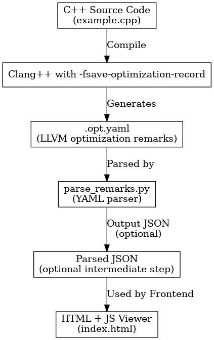

# LLVM Remarks Viewer Demo

This is a lightweight demo tool to **parse and visualize LLVM optimization remarks** (`.opt.yaml` files) generated by Clang. It helps developers understand what optimizations were applied (or missed) and why.

---

## 🔄 LLVM Remarks Visualization Flow

The diagram below shows the full process from compiling a C++ source file with Clang, to generating `.opt.yaml`, parsing it with Python, optionally outputting JSON, and displaying the result in a browser.



---

## 🛠 How It Works

1. **Compile a C++ file with optimization remarks enabled:**
   ```bash
   clang++ -fsave-optimization-record=yaml example.cpp -o example
   ```

   This will generate a file named `example.opt.yaml` in the current directory.

2. **Run the Python parser:**
   ```bash
   python3 parse_remarks.py
   ```

   This reads the `.opt.yaml` file and optionally outputs a simplified `.json` file.

3. **(Optional) View with the HTML page:**
   Start a local server:
   ```bash
   python3 -m http.server 8000
   ```
   Then open `http://localhost:8000/index.html` in your browser.

---

## 📁 Project Structure

```
llvm-remarks-viewer-demo/
├── example.cpp                  # Sample C++ source code
├── example.opt.yaml             # Optimization remarks generated by Clang
├── parse_remarks.py             # Python script to parse .opt.yaml
├── parsed_output.json           # (Optional) JSON version for frontend use
├── index.html                   # Simple HTML/JS front-end
├── llvm_remarks_flow_updated.png # Updated architecture diagram
└── README.md                    # This file
```

---

## 🚀 Future Plans

- Add filtering/grouping by optimization pass
- Highlight source location (file + line)
- Display summary statistics (counts, common passes)
- Explore LLM integration for explaining remarks

---

## 📜 License

This project uses the MIT License.

---

## 🙋‍♀️ Author

Created by [Le Li](https://github.com/leyli16) as part of a GSoC demo for the LLVM project.
