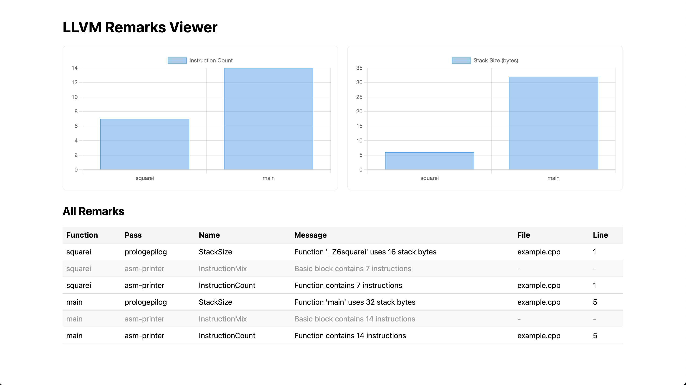

# LLVM Remarks Viewer Demo

This is a lightweight demo that **parses and visualizes LLVM optimization remarks** (`.opt.yaml` files) generated by Clang. It helps developers quickly understand what optimizations were applied—or missed—and why.

---

## 💻 Example C++ Code

The following simple C++ program is used to generate LLVM remarks for this demo:

```cpp
int square(int x) {
    return x * x;
}

int main() {
    int a = square(5);
    return 0;
}
```

Compile it using:

```bash
clang++ -fsave-optimization-record=yaml example.cpp -o example
```

This will produce `example.opt.yaml`, which you can then parse and visualize.

---

## 📷 Demo Preview

### 🖼 Frontend UI Screenshot

The screenshot below shows the frontend UI rendering a demo remarks file with bar charts and a remark table:



---


## 🔄 How It Works (Usage Guide)

### 1. Generate LLVM Optimization Remarks (YAML)

Compile your C++ file using Clang with optimization remark output enabled:

```bash
clang++ -fsave-optimization-record=yaml example.cpp -o example
```

This will generate `example.opt.yaml`.

### 2. Convert YAML to JSON

Run the Python parser to extract structured data:

```bash
python3 parse_remarks.py
```

This will output `remarks.json`.

### 3. Launch the Frontend UI

Start a local server and view the HTML frontend:

```bash
python -m http.server
```

Then visit `http://localhost:8000/index.html` in your browser to see the visualized data.

---

## 🗂 Project Structure

```
llvm-remarks-viewer-demo/
├── example.cpp                  # Sample C++ source code
├── example.opt.yaml             # Optimization remarks generated by Clang
├── parse_remarks.py             # Python script to parse .opt.yaml
├── remarks.json                 # Output JSON used by frontend
├── demo_remarks.json            # Static sample file for demo UI
├── index.html                   # HTML+JS frontend for visualization
├── screenshot.png               # UI screenshot
├── llvm_remarks_flow_updated.png # Architecture diagram
└── README.md                    # Project documentation
```

---

## 📊 Remarks Visualization Flow

This diagram shows how the pieces connect:


---

## 🔍 Why These Fields Are Visualized

LLVM’s `.opt.yaml` files include many low-level remarks. This tool extracts only the most relevant, actionable fields to help developers quickly interpret compiler decisions:

| Field              | Reason for Visualization                                                                 |
|--------------------|-------------------------------------------------------------------------------------------|
| `Function`         | Identifies which function the remark applies to                                          |
| `Pass` / `Name`    | Shows which compiler pass emitted the remark and what type it is                         |
| `StackSize`        | Key for understanding stack usage in offload/accelerated contexts                        |
| `InstructionCount` | Useful for estimating function complexity and potential inlining                         |
| `DebugLoc`         | Enables mapping remarks to source lines                                                  |

---

## 🧾 JSON Output Format

The `remarks.json` file contains simplified entries ready for UI rendering.  
See `demo_remarks.json` as a reference.

Each entry includes:

| Field     | Description                                                                 |
|-----------|-----------------------------------------------------------------------------|
| `Pass`    | LLVM pass that generated the remark (e.g., `asm-printer`)                  |
| `Name`    | Type of remark (e.g., `StackSize`, `InstructionCount`)                    |
| `Function`| Name of the function being remarked on                                     |
| `Message` | Human-readable description of the remark                                   |
| `File`    | Source file where the remark originated (if available)                    |
| `Line`    | Line number in the source file (if available)                             |

---

## 🚀 Future Improvements

- Filtering and grouping by pass, type, or function
- Inline source code integration
- Summary statistics (counts, top remarks)
- Natural language (LLM-based) explanations

---

## 📜 License

This project is licensed under the MIT License.

---

## 🙋‍♀️ Author

Created by [Le Li](https://github.com/leyli16) as part of a GSoC demo for the LLVM project.
